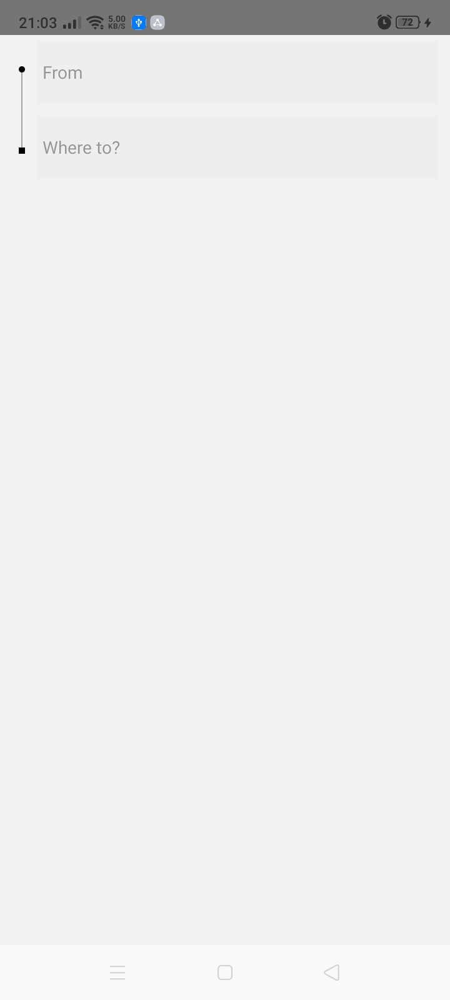

# Yamore UI
Yamore is an Uber Clone app built with react-native, this is the UI of the passenger application.

## Front-end Tech
* React native
* React navigation
* React Hooks
* Vector icons
* Google maps
  
## ScreenShots

# Coming Soon ...
## Back-end Tech
* AWS Amplify
* AWS AppSync
* AWS DynamoDB
* GraphQL